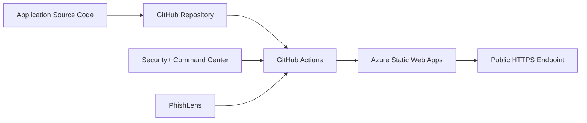

# Azure Static Web Apps CI/CD Lab

A hands-on Microsoft Azure deployment project documenting how I deployed two cybersecurity web applications that I created from GitHub to **Azure Static Web Apps** using **GitHub Actions CI/CD**.

## Project Overview

This lab demonstrates a complete source-control-to-cloud deployment workflow:

```text
Application code
      |
      v
GitHub repository
      |
      v
GitHub Actions CI/CD
      |
      v
Azure Static Web Apps
      |
      v
Public HTTPS web application
```

Both deployed applications were designed and created by **John Tyler (johninfra)**. This repository documents the Azure deployment architecture and process; the application source code remains in each application's dedicated GitHub repository.

## Deployed Applications

### 1. Security+ Command Center

A browser-based CompTIA Security+ SY0-701 study dashboard with original practice questions, flashcards, acronym review, ports/protocols references, missed-question tracking, domain accuracy, and local progress storage.

- **Created by:** John Tyler / johninfra
- **Source repository:** https://github.com/johninfra/security-plus-command-center
- **Azure service:** Azure Static Web Apps
- **Source branch:** `main`
- **Deployment:** GitHub Actions CI/CD
- **Application type:** Static HTML/CSS/JavaScript
- **Backend/API:** None required

### 2. PhishLens — Phishing Email Detector

A self-contained browser-based phishing email triage application designed to help inspect suspicious messages, identify indicators, and explain why a message may deserve additional scrutiny.

- **Created by:** John Tyler / johninfra
- **Source repository:** https://github.com/johninfra/phishing-email-detector
- **Azure service:** Azure Static Web Apps
- **Source branch:** `main`
- **Deployment:** GitHub Actions CI/CD
- **Application type:** Static HTML/CSS/JavaScript
- **Backend/API:** None required

## Video Walkthrough

I recorded a public walkthrough showing the Azure portal, both deployed Static Web Apps, and the applications opening from Azure.

**Watch:** https://youtu.be/Gj0A1xJ5hoo

[](https://youtu.be/Gj0A1xJ5hoo)

## Architecture



Each application has its own GitHub repository and its own Azure-generated GitHub Actions workflow. A push to the `main` branch can trigger the corresponding workflow, which deploys the current application content to its Azure Static Web App.

## Deployment Configuration

Both applications use the same general deployment pattern:

| Setting | Configuration |
|---|---|
| Azure service | Azure Static Web Apps |
| Source | GitHub |
| Branch | `main` |
| Build preset | Custom |
| App location | `/` |
| API location | None |
| Output location | `.` in generated workflow |
| Deployment authorization | Deployment token |
| Hosting model | Static client-side application |
| CI/CD | GitHub Actions |

Azure generated a workflow in each source repository under `.github/workflows/` using `Azure/static-web-apps-deploy@v1`.

## CI/CD Behavior

The generated workflows are configured to run on:

- pushes to `main`;
- pull requests targeting `main`;
- pull-request close events for cleanup of the associated Static Web Apps environment.

The Azure deployment credential is referenced through a **GitHub Actions secret**. No deployment token value is stored in this documentation repository.

## Skills Demonstrated

This project demonstrates practical experience with:

- Microsoft Azure resource deployment
- Azure Static Web Apps
- GitHub source control integration
- GitHub Actions
- CI/CD fundamentals
- cloud-hosted static application delivery
- deployment-token based authorization
- repository-to-cloud deployment workflows
- HTTPS-hosted web workloads
- Azure portal navigation and resource verification
- documenting cloud architecture and deployment decisions

## Repository Structure

```text
azure-static-web-apps-cicd-lab/
├── README.md
├── SECURITY.md
├── .gitignore
└── docs/
    ├── architecture.md
    ├── deployment-guide.md
    └── verification-checklist.md
```

## Why This Lab Matters

The goal of this project was not simply to host an HTML page. It was to take applications I built, keep their source under version control, integrate those repositories with Microsoft Azure, and establish an automated deployment path through GitHub Actions.

That creates a repeatable workflow in which source-code changes can move from GitHub into an Azure-hosted environment through CI/CD rather than through manual file uploads.

## Security Notes

- Deployment tokens must remain in GitHub Actions secrets and must never be committed to source control.
- This repository intentionally contains no credentials, tokens, tenant secrets, or private keys.
- Both applications are client-side static applications and do not require a backend API for their current functionality.
- Public application access and Azure resource-management access are separate concerns. Azure RBAC governs management of Azure resources, while the deployed Static Web Apps can be publicly reachable unless application-level access restrictions are configured.

See [SECURITY.md](SECURITY.md) for additional guidance.

## Documentation

- [Architecture](docs/architecture.md)
- [Deployment Guide](docs/deployment-guide.md)
- [Verification Checklist](docs/verification-checklist.md)

## Author

**John Tyler**  
GitHub: [@johninfra](https://github.com/johninfra)

The Security+ Command Center and PhishLens applications documented in this repository were created by me and deployed from my GitHub repositories into my Microsoft Azure environment.

---

*Portfolio lab documenting hands-on Azure, GitHub, and CI/CD implementation.*
