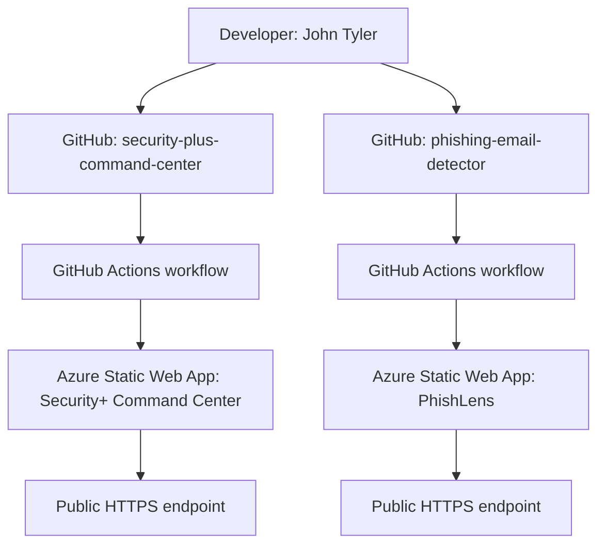

# Architecture

## Overview

This lab uses Azure Static Web Apps to host two client-side cybersecurity applications that I created:

1. **Security+ Command Center**
2. **PhishLens — Phishing Email Detector**

Each application remains in its own GitHub repository and is deployed independently to Azure.

## Logical Architecture

## Deployment Flow

For each application:

1. Source code is stored in GitHub.
2. Azure Static Web Apps is connected to the GitHub repository.
3. Azure creates a GitHub Actions workflow.
4. The workflow checks out the repository on a GitHub-hosted runner.
5. `Azure/static-web-apps-deploy@v1` packages and deploys the static application.
6. Azure serves the application over HTTPS.

## Current Workflow Configuration

The generated workflows use:

- `main` as the deployment branch
- `app_location: "/"`
- no API directory
- `output_location: "."`
- a GitHub Actions secret containing the Azure Static Web Apps deployment token

## Identity and Access Boundaries

There are two distinct security planes:

### Azure management plane

Controls who can create, modify, delete, or inspect the Azure resource. This is governed by Azure RBAC at the subscription, resource group, or resource scope.

### Application access plane

Controls who can browse the deployed site. Static Web Apps can be publicly accessible even when only a small number of administrators can manage the Azure resource.

## Application Architecture

Both deployed projects are intentionally lightweight static applications:

- no server-side application runtime required
- no database required
- no backend API required for current functionality
- HTML/CSS/JavaScript delivered directly to the browser

This makes Azure Static Web Apps a more appropriate hosting service than Azure App Service runtimes such as .NET, Node.js, Python, PHP, or Java for these specific projects.
